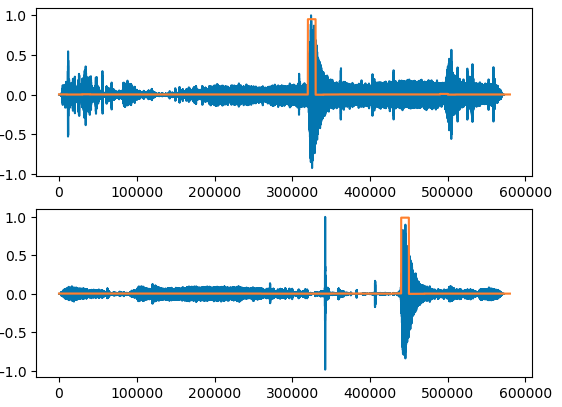

# Space Murmurs - SpaceApps 2024 Hackathon

By [Danielius](https://github.com/dvisockas) and [Lukas](https://github.com/lumzdas).

## Seismic Detection Across the Solar System

[Link to the challenge](https://www.spaceappschallenge.org/nasa-space-apps-2024/challenges/seismic-detection-across-the-solar-system/?tab=resources) | [Link to the data packet](https://wufs.wustl.edu/SpaceApps/data/space_apps_2024_seismic_detection.zip)

TLDR of the challenge is that given a signal (in blue), you need to find where a seismic even happened (the red line).

## Work done during the hackathon

The first step was to look at the data. If you zoom into the seismic event - there are actually a LOT of datapoints and you get a different view on the data.

***Note:** In order to normalize the data we simply divided the data by 1.5e-7*

### Training the model

We looked at the seismic events as speech produced by a celestial body. Because of that we decided to train a convolutional neural network. These types of networks are used for speech processing. Mostly we repurposed my [Master thesis on denoising speech](https://github.com/dvisockas/norse).

In order to train the neural network we split the signal into chunks of 10k samples. Each sample has a binary label - was there an event or there wasn't one.
The neural network is a rather simple Convolutional neural network with 4 Convolutional layers (having 16, 32, 32 and 64 channels and a GELU activation function), an Adaptive average pooling layers and 2 fully connected layers (with a depth of 256 and 128).

The training was done on a T4 Nvidia GPU for 10 epochs at 1e-4 learning rate.

To visualize the outputs of the network we took data from an unseen mission. Looks like it finds the seismic events!

